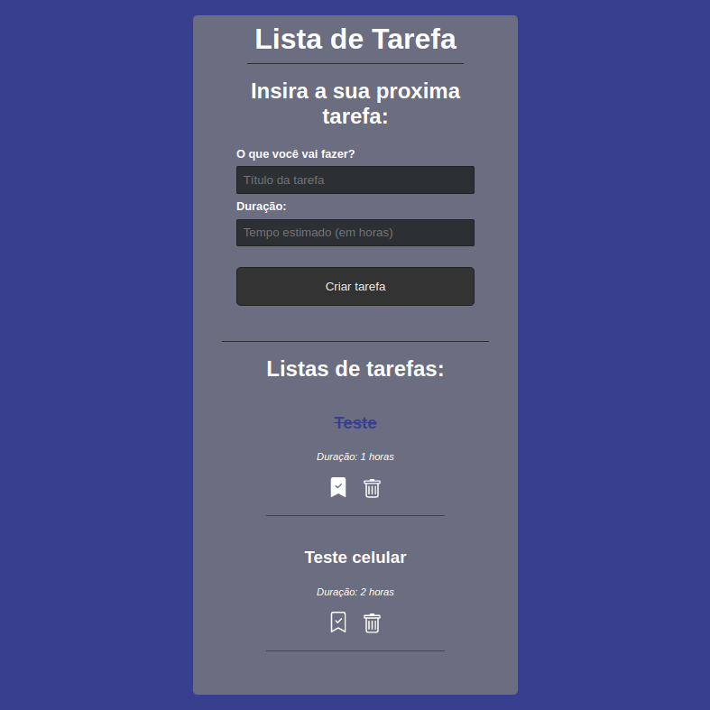

<h1 align="center">To-do list</h1>

<p align="center">Um projeto desenvolvido em React com a base de dados feita em Supabase</p>

<h1 align="center">
  
</h1>

### Pré-requisitos

Antes de começar, você vai precisar ter instalado em sua máquina as seguintes ferramentas:
[Git](https://git-scm.com), [Node.js](https://nodejs.org/en/). 
Além disto é bom ter um editor para trabalhar com o código como [VSCode](https://code.visualstudio.com/)

### 🎲 Rodando o projeto no seu local

```bash
# Clone este repositório
$ git clone <https://github.com/GabrielAnjos011/todo-list-react.git>

# Acesse a pasta do projeto no terminal/cmd
$ cd todo-list-react

# Instale as dependências
$ npm install

# Para execultar o backend local, obs: Para isso funcionar descomenta a manipulação da api e comenta a manipulação feita pelo Supabase
$ npm run server

# O servidor inciará na porta:5000 - acesse <http://localhost:5000>

# Para rodar o projeto em React
$ npm start
```
</br>
### 🛠 Tecnologias

As seguintes ferramentas foram usadas na construção do projeto:

- [React](https://pt-br.reactjs.org/)
- [Json-server](https://github.com/typicode/json-server)
- [React Icons](https://react-icons.github.io/react-icons/)
- [React-toastify](https://fkhadra.github.io/react-toastify/introduction/)
- [Supabase](https://supabase.com/)

